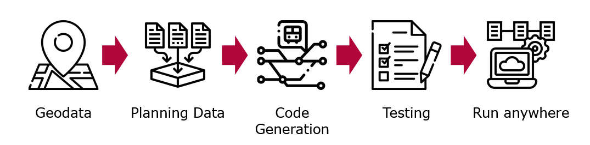

# codegen

This repository contains the results of the Master Project 2022/23 "Dispatching Trains from the Cloud". 
It is divided into a few subprojects:

- `code_generation`: A program that given a JSON file from the [interlocking exporter](https://github.com/simulate-digital-rail/interlocking-exporter) generates interlocking code in Rust using the [`track_element`](https://github.com/simulate-digital-rail/track_element) crate.
- `grpc_control_station`: A frontend for the generated interlocking that can be used with the EULYNX Live Lab UI.
- `ui`: A web-based application to generate interlockings from OpenRailwayMap data.

The subprojects all contain a README with local setup instructions. To run the project as whole,
you can use the provided dockerfile by running the following commands from the project root: 
```shell
docker build -t instant-interlocking .
docker run --net host instant-interlocking
```
Note that the `--net host` is mandatory as we are starting the interlocking instances on new ports.
You can reach the UI via http://localhost:5000

## Motivation

Even though digital tools are available, most railway planning still happens with analog methods.
Digital planning data generated from publicly available data sources could serve as a basis for
new building projects. This project explores a pipeline that transforms geodata from public sources
into planning data and generates executable interlocking code from this planning data.

## The Pipeline

This project presents a pipeline for generating executable interlocking code from planning data.



The pipeline starts by extracting planning information from geodata (e.g. OpenRailwayMap). This planning
data (which includes information such as where tracks, points, and signals are located) is then used to
generate possible driveways and enriched with the information what states track elements have to be in
for a driveway to be set. We then use this enriched planning data to create executable Rust code that 
uses the `track_element` crate.

Beyond this step, two independent projects explored the viability of using WebAssembly to test and
deploy the generated code.